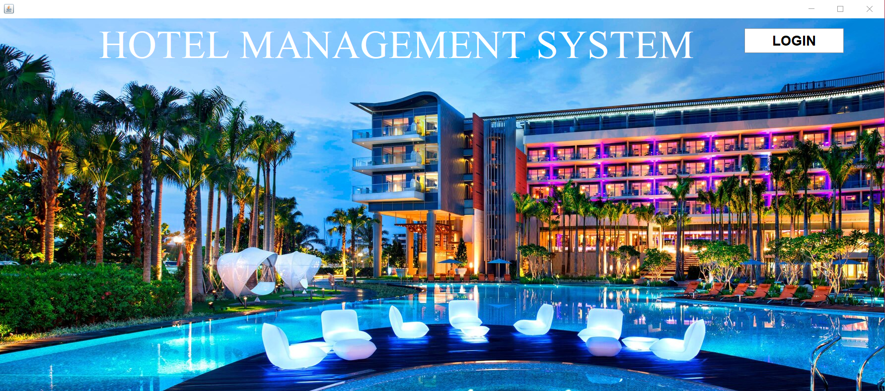
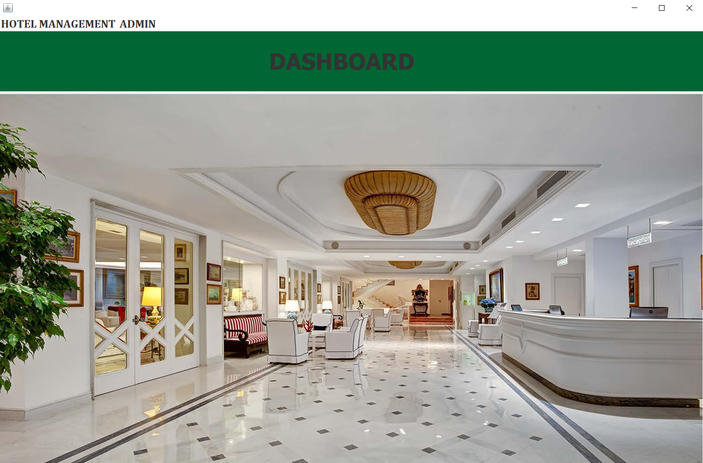
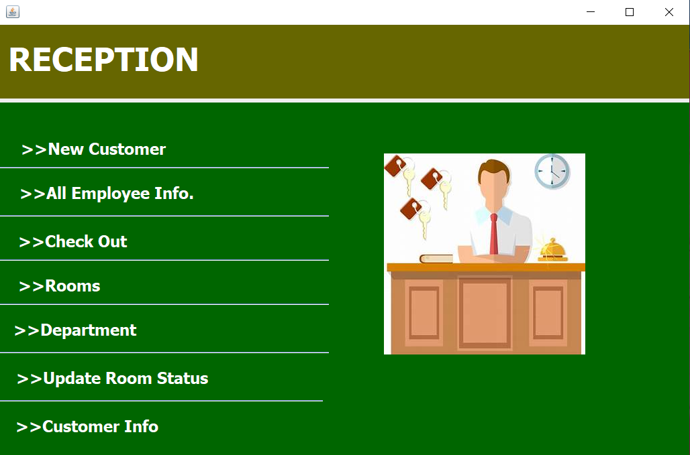
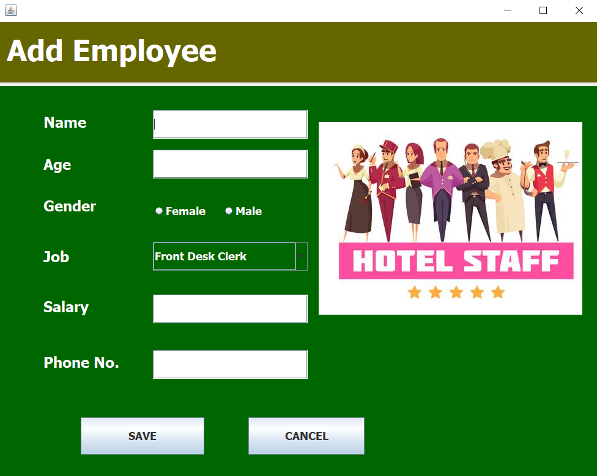
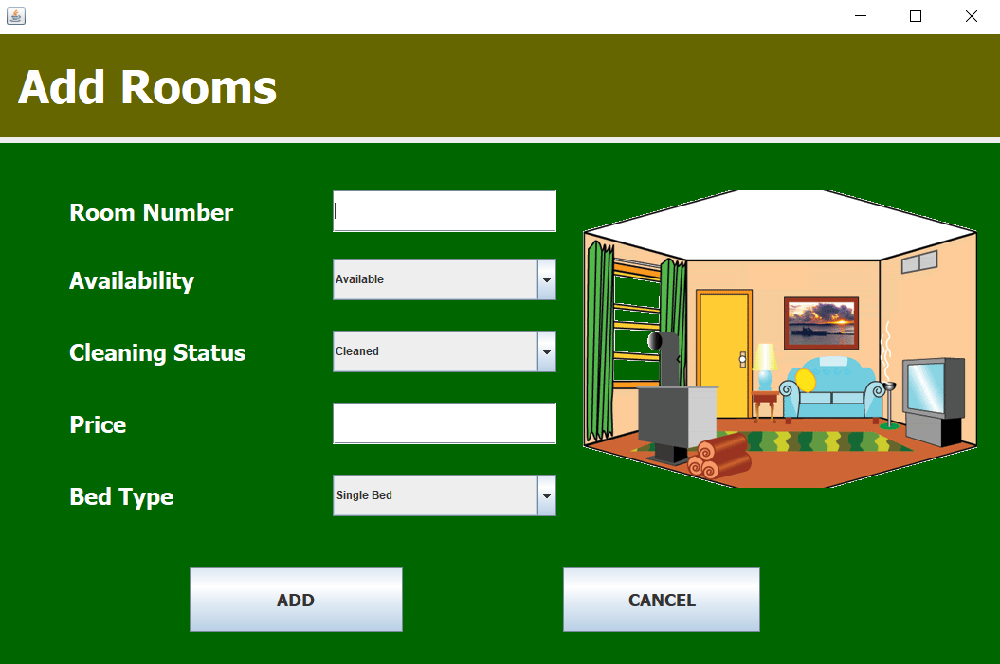
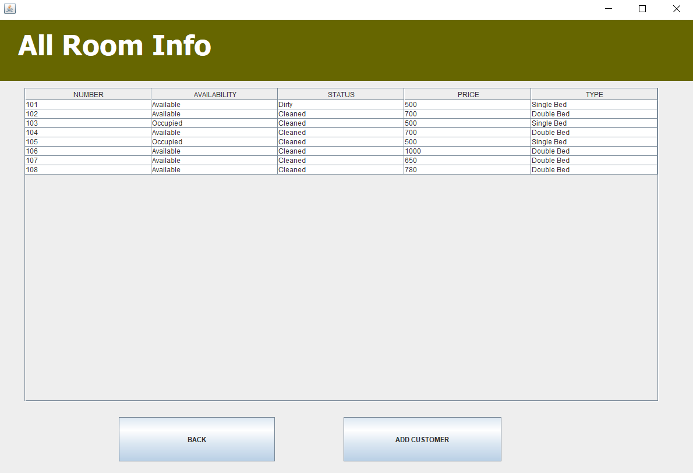
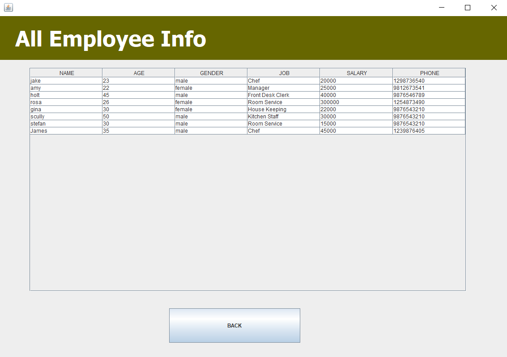
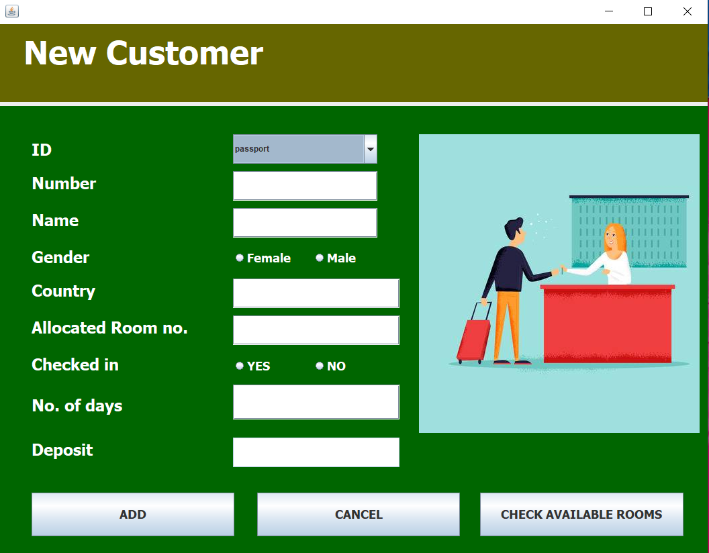

# hotel_managment
The main objective of this project is to perform basic functionalities of booking a customer, adding employees and rooms, updating and checking information, checking out etc. This project is entirely build at administrative end and thus only the administrator is guaranteed the access.

Language Used - Java Core

Concept Used - Swing

Database Used - MySQL

IDE Used - Netbeans

